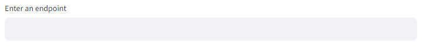

# 🚀 Bubble Data Extractor

### 📝 About the App
  The Bubble Data Extractor is a sophisticated tool designed for seamless integration with Bubble's application database. This application, developed using Streamlit and Python, enables users to fetch and export data efficiently by constructing dynamic API URL endpoints based on user-specified constraints. By leveraging this tool, users can tailor their data retrieval processes to meet specific criteria, ensuring that they receive precisely the data they need for their analysis, reporting, or other data-driven tasks.

### 🔑 Key Features
1. User-Friendly Interface: Leveraging Streamlit's interactive capabilities, the app provides an intuitive interface for users to interact with and specify their data retrieval requirements.
2. Dynamic Data Fetching: Users can input constraints directly into the app, which are then applied to the API URL endpoint to fetch specific data from the Bubble application database.
3. Flexible Constraints: The application supports a variety of constraints, enabling users to filter data based on multiple criteria to meet their specific needs.
4. Data Exporting: Once the data is fetched, users can easily export it in an Excel format (.xlsx), facilitating further analysis or reporting.

### 📖 Usage
1. Input Constraints: Users can enter constraints in the designated fields within the app interface. These constraints can include specific fields, conditions, or ranges to filter the desired data.
2. Data Retrieval: Upon submitting the constraints, the application constructs the appropriate API URL endpoint and retrieves the data from the Bubble database.
3. Data Display: The retrieved data is displayed within the app, allowing users to review and verify the information.
4. Data Exporting: Users can export the data in Excel format (.xlsx) for further use or analysis.

### 🛠️ Technical Specification
1. Frontend: Streamlit framework provides an interactive web-based interface for user inputs and data display.
2. Backend: Python scripts handle the construction of API URL endpoints based on user-defined constraints and manage data retrieval from the Bubble application database.
3. API Integration: The application interacts with Bubble's Data API to fetch and filter data based on dynamically generated URL endpoints.

### 📄 Pages
- **Fetch Data**
  - The Fetch Data page is the core functionality of the app, where users input the Data API URL endpoint provided by Bubble. On this page, users can configure constraints to specify exactly what data they wish to retrieve from Bubble’s database. After configuring the constraints, users can initiate the data fetching process. The page provides a clear interface to enter the API URL, set filtering criteria, and view the fetched data in a tabular format.
- **Users Guide**
  - The Users Guide page is a comprehensive manual designed to help end-users effectively navigate and utilize the Data Fetcher and Exporter App. It provides detailed step-by-step instructions on how to perform various tasks, such as entering the API URL, applying constraints, and exporting data. The guide also includes troubleshooting tips and common use cases to ensure users can make the most out of the app’s features with ease and confidence.
- **Developers Guide**
  - The Developers Guide page provides detailed instructions on how to run the Data Fetcher and Exporter App locally. This guide includes step-by-step setup instructions to help developers get the app up and running on their local machines. It covers prerequisites, installation of necessary libraries, configuration of environment variables, and execution of the app. The guide ensures that developers can easily set up the app in their local environment for development and testing purposes.
- **Constraints**
  - The Constraints page provides detailed guidance on how to use various constraint types available in Bubble’s Data API. This page serves as an informational resource, offering explanations and examples for applying different types of constraints such as field constraints, comparison operators, list constraints, and search constraints. It helps users understand how to configure their data queries effectively but does not include interactive elements for setting constraints directly.
- **Limitations**
  - The Limitations page outlines the constraints and potential issues associated with using the Bubble Data Extractor. This page provides an overview of the limitations related to data size, complexity of constraints, API rate limits, and performance considerations. It helps users understand the boundaries and challenges of the app, ensuring they are aware of any potential impacts on their data retrieval and analysis processes.
- **About**
  - The About page offers a comprehensive overview of the Data Fetcher and Exporter App. It includes key information about the app, such as its features, usage instructions, and technical specifications. Additionally, this page provides details about the app's developer, including its role in the company. The About page aims to give users a clear understanding of the app’s purpose, capabilities, and development context.


# Users Guide 📖
### 📘 How to Use

To get started using the app, you first need to access it via this web address: https://bubble-data-extractor.streamlit.app/

### Fetching data from the app
1. After accessing the website, you need to put a valid Bubble Data API endpoint (e.g., https://[app name].bubbleapps.io/api/1.1/obj/[data type/data table]) in the text input shown in the image.

2. After that, you can filter data by clicking the "Add Column to Filter" button, specifying the column you want to filter, the constraint type, and, if necessary, the value you need to filter the column by. If you're done filtering, just click the "Filtering Done" button below. For more information on constraint types, go to the Constraints tab of the app.

- If you don't want to filter the data, you can also just click "Filtering Done" to fetch all the data on the endpoint provided.


- Things to note when filtering by date:
  - If you filter by date, the value will change to a date input, and you need to select the date you want to filter your data by. For the date that you selected, for example, 8/7/2024, its hours, minutes, and seconds will all be 0. Basically, it is the very first start of the day.
  - So if you want to filter the data within a specific date range, you need to use "greater than" and "less than" as your constraint types. Basically, you filter by two columns with the same name (e.g., Created Date) to filter the data with a specific date range.
  - For example, if you want to filter data from January 1, 2024, to May 31, 2024, you will first add a column, such as "Created Date." Select "greater than" as the constraint type and input January 1, 2024. Next, add another column, choose "less than" as the constraint type, and input June 1, 2024, instead of May 31, 2024. This is because the time for the date will default to 0, so inputting June 1 ensures that data for May 31 is included. Essentially, inputting the day after your end date covers all data up to and including May 31.
 
- Things to note when filtering by number:
  - When writing a number as a value, don't use a comma (,) to separate digits. This is to avoid not filtering the data you want, just use the normal format of a number without any commas.

3. When you click the "Filtering Done" button, the data you requested will be fetched from Bubble's application database, and this process might take some time depending on the amount of data being fetched from the database. To know more about the limitations of Bubble, go to the "Limitations" tab of the app.

4. After the data has been fetched, there will be a "Download Excel" button below the "Filtering Done" button you can click in order to download the data in Excel format.

5. Lastly, the final URL endpoint is shown every time you add a URL endpoint or add columns to filter. This is purposely done for you to also check the response being received by the app. You can click on the URL being generated to check the response.


# Developers Guide 💻
### ✅ Requirements:
- A command line interface or terminal where you can type commands.
- An IDE (Integrated Development Environment) or any editor where you can run python applications.

### How to Run the App Locally
**Note:** In this guide, I will use VS Code as my code editor and the set-up for other editors might be different from this. I prefer you to use the same editor as I have, but if you know how to set-up the Python environment for your editor of choice, then you can freely do that.

1. Choose the location where you want to store the app. You can do this by changing directory (cd) to your command line to locate where you want to put the app's files.
- **Sample:**
```bash
cd Users/SPM/Desktop/Kim-Intern/
```
- You can also just create a folder where you want to store the app. You can use the command shown below.
```bash
mkdir [folder name]
```
2. After that, you can now clone the app in the remote repository on github (https://github.com/KimTan021/spm_api) and run the command below in the terminal.
```bash
git clone https://github.com/KimTan021/bubble_data_extractor.git
```
- The files of the app will be downloaded at the location where you put it in.
3. Open the app in the editor of your choice.

4. Set-up the Python environment
- To create a python environment for the app, run the command below on your terminal. If you are using VS Code, you can also click on "Terminal" on the navigation bar and click "New Terminal".
```bash
python -m venv .venv
```
- After the environment has been created, run the command below to cd (change directory) over to the .venv file created
```bash
cd .venv
```
- cd over to the Scripts folder
```bash
cd Scripts
```
- Then, type "activate"
```bash
activate
```
- After that, you will see "(.venv)" on the left side of your directory like in the example shown below.
```bash
(.venv) C:\Users\Python-Projects
```
5. Go back to your main directory or the folder you created to store the app's files, then run the command below.
```bash
pip install -r requirements.txt
```
- This will install all the dependencies and packages you need to run the app.
6. To run the app, just type "streamlit run app.py" on the command line or terminal.
```bash
streamlit run app.py
```
7. The app will open to your default web browser.


# Constraints 🚧
### Overview
Constraints in Bubble's Data API allow users to filter data based on specific criteria. By applying constraints, you can retrieve only the data that matches your requirements. Constraints are specified in the API request URL and can be combined to form complex queries.

### Constraint Types
Constraint Type | Description | Field Types
--- | --- | ---
equals or not equal | Use to test strict equality | All field types
is_empty or is_not_empty | Use to test whether a thing's given field is empty or not | All field types
text contains or not text contains | Use to test whether a text field contains a string. Text contains will not respect partial words that are not of the same stem. | Text fields only
greater than or less than	| Use to compare a thing's field value relative to a given value | Text, number, and date fields
in or not in | Use to test whether a thing's field is in a list or not for all field types. | All field types
contains or not contains | Use to test whether a list field contains an entry or not for list fields only. | List fields only
empty or not empty | Use to test whether a list field is empty or not for list fields only. | List fields only

For more information on constraints, please refer to the [Bubble API documentation](https://manual.bubble.io/).

# Limitations ⚠️
### Overview
Bubble is a powerful no-code platform that enables users to build complex web applications without traditional programming. However, despite its many strengths, there are certain limitations to consider when using Bubble.

### Limitations
- There is a limit of 50,000 items in any GET request, meaning that if a database contains 100,000 items and the cursor is set at 50,001 no results will be returned.
- For the Enterprise plan the limit is 10,000,000 items.
- The URL endpoint you will use in the app to extract data is limited to Bubble's Data API endpoints. The main reason for this limitation is that different API calls have their own methods of sending data, specifically the JSON data they transmit. As a result, the code is designed to accept data formatted according to how Bubble sends their data using their API.

For more information on limitations, please refer to the [Bubble API documentation](https://manual.bubble.io/).

### 📧 Contact Developer
**Developer:** Kim Emerson M. Tan

**Email:** kmtan@spmadridlaw.com

**Github:** [github.com/KimTan021](https://github.com/KimTan021)
